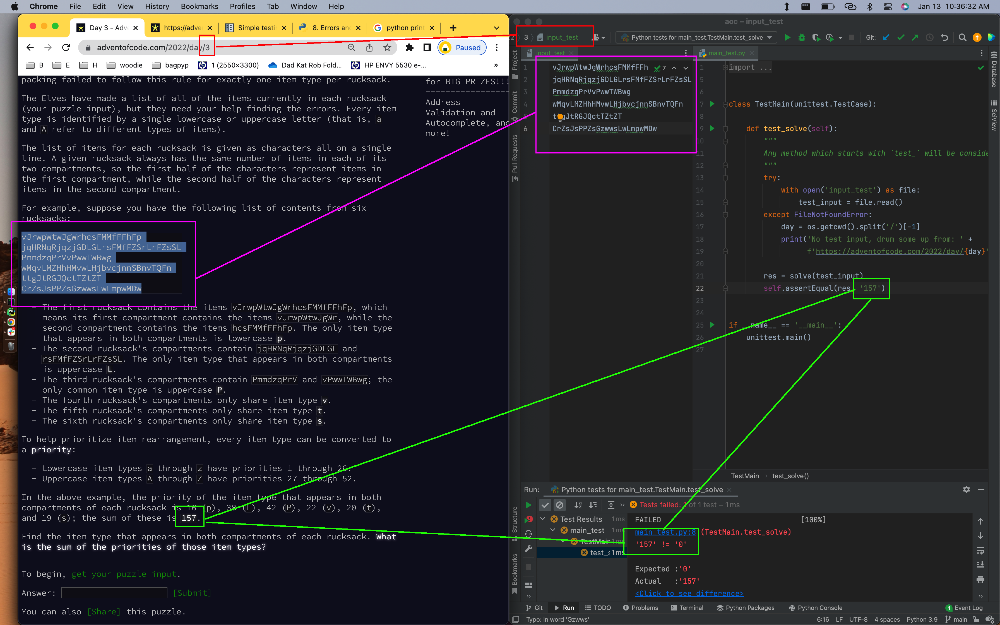
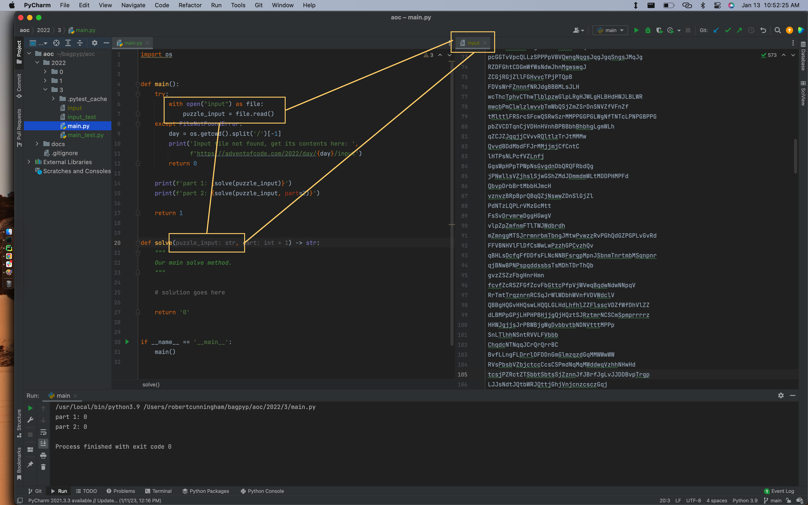

# Advent of Code _with python!_

## Testing

We'll be using the `unittest` module that ships with python's standard library

## Coding

When we write code we'll do it inside a method called `solve`, which our raw `puzzle_input` will be loaded into.  

